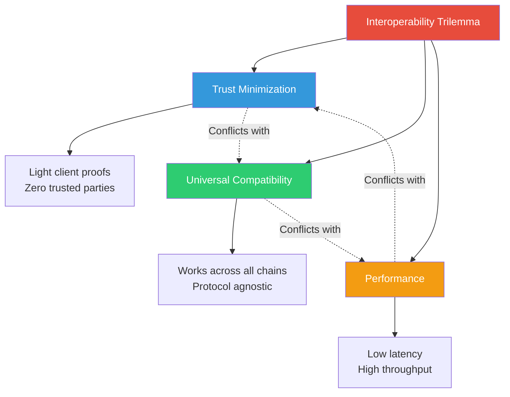
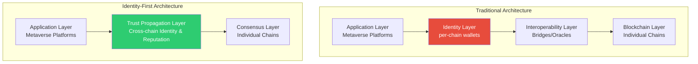
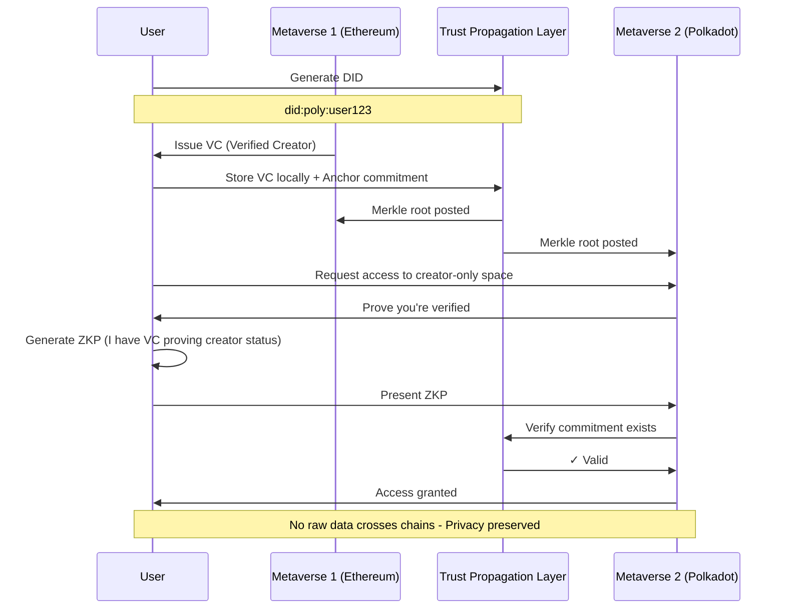
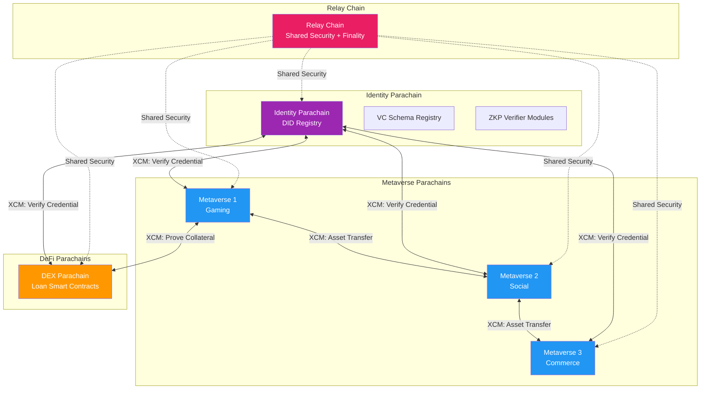

Here's a paradox that should terrify every Web3 architect: We've successfully built 14+ thriving metaverse platforms hosting 400 million users, yet these digital universes remain as isolated as medieval kingdoms. Users routinely traverse multiple platforms, but their identities, assets, and reputations evaporate at each border crossing. Meanwhile, cross-chain bridges—our primary interoperability solution—have hemorrhaged $2.8 billion in exploits, representing 40% of all Web3 hacks.

The conventional narrative focuses on technical interoperability: "How do we move assets between chains?" But this question fundamentally misframes the problem. **The real challenge isn't moving data—it's establishing trust without recreating centralized gatekeepers.**

This article dissects why metaverse interoperability demands a paradigm shift in how we architect decentralized identity, explores the deep trade-offs in cross-chain systems, and proposes a novel framework for thinking about trust propagation across heterogeneous blockchain networks.

---

## Part I: The Fragmentation Problem—Deeper Than You Think

### Why Current Solutions Fail: The Interoperability Trilemma

Most discussions of blockchain interoperability focus on Vitalik Buterin's "blockchain trilemma" (security, scalability, decentralization). But cross-chain systems face a distinct, underappreciated constraint I call the **Interoperability Trilemma:**



**The Trilemma Explained:**

1. **Trust Minimization:** Light client bridges offer maximum security by running simplified blockchain validators, requiring no trust beyond the underlying chains. However, they're computationally expensive and typically limited to specific chain pairs.

2. **Universal Compatibility:** Protocol-agnostic solutions like Axelar or LayerZero can connect any chain but introduce new trust assumptions through validator sets or oracles—creating security bottlenecks.

3. **Performance:** Fast bridges sacrifice either trust minimization (centralized validators) or compatibility (chain-specific optimizations).

**No current solution escapes this trilemma.** Polkadot's XCM achieves 1+3 (trust-minimized + performant) but only within its parachain ecosystem. Ethereum's light clients achieve 1+2 (trust-minimized + compatible) but take hours for finality. Centralized bridges achieve 2+3 (compatible + fast) but create honeypots for attackers.

### The Hidden Cost: Identity Fragmentation

Beyond the trilemma, there's a meta-problem nobody discusses: **Identity fragmentation creates compounding security and UX debt.**

When a user operates across multiple metaverses, they currently face:

- **Reputation Isolation:** Your Decentraland status means nothing in The Sandbox
- **Credential Redundancy:** KYC repeated for every platform, creating multiple attack surfaces
- **Sybil Attack Amplification:** Easy to spin up 1000 identities across platforms, each appearing legitimate
- **Privacy Paradox:** Either link all activities (destroying privacy) or maintain separate identities (destroying portability)

This isn't just inconvenient—it fundamentally undermines the value proposition of decentralized systems.

---

## Part II: A New Framework—The Identity-First Architecture

### Introducing the Trust Propagation Layer (TPL)

Rather than treating identity as an application built atop interoperability infrastructure, we should **invert the stack**: make identity the foundational layer upon which cross-chain operations are built.



The **Trust Propagation Layer (TPL)** serves as a universal identity substrate with three core primitives:

1. **Decentralized Identifiers (DIDs):** Chain-agnostic roots of trust
2. **Verifiable Credentials (VCs):** Portable attestations
3. **Zero-Knowledge Proofs (ZKPs):** Privacy-preserving selective disclosure

This isn't just theoretical—it's the architecture behind PolyVerID and similar frameworks. But most implementations miss a crucial insight.

### The Missing Piece: Reputation as a State Channel

Here's the key innovation: **Treat cross-chain reputation as a state channel problem, not a data availability problem.**

Traditional approaches try to replicate identity state across chains—expensive and slow. Instead:

1. **Anchor commitments** to reputation state on multiple chains simultaneously (Merkle roots of VC collections)
2. **Present proofs** locally when needed (ZKPs derived from VCs)
3. **Update infrequently** only when reputation materially changes
4. **Resolve disputes** through challenge-response mechanisms



**Why this matters:** Instead of expensive cross-chain messages for every interaction, we perform one-time anchoring and then local verification. Latency drops from seconds to milliseconds. Cost drops from dollars to cents. Privacy improves—verifiers see proofs, not raw data.

---

## Part III: Deep Dive—Polkadot as the Identity Backbone

### Why Polkadot? (And Why Not Just Use Cosmos/Ethereum?)

The original presentation proposes Polkadot for metaverse interconnectivity. This isn't arbitrary marketing—Polkadot's architecture offers unique properties for identity systems:

**1. Shared Security Model**

Ethereum's rollup-centric roadmap and Cosmos's sovereign chains both require each execution environment to bootstrap its own security. Polkadot's relay chain provides shared security to all parachains, meaning:

- **No fragmentation of trust assumptions** when moving between metaverse platforms on different parachains
- **Economic finality** guaranteed by the entire network's stake (~$7B+ as of 2025)
- **Eliminates bridge validator vulnerabilities** that plague cross-ecosystem transfers

**2. XCM: A Message Format, Not a Protocol**

Most cross-chain solutions couple message semantics with transport layers. Polkadot's XCM (Cross-Consensus Messaging) is deliberately just a format:

```rust
// Simplified XCM structure
Xcm([
    WithdrawAsset(assets),
    BuyExecution { fees, weight },
    DepositAsset { assets, beneficiary },
])
```

This separation enables:

- **Semantic richness:** XCM can express complex intent (e.g., "Prove credential, then execute if valid")
- **Future-proof:** New transports can emerge without changing message semantics
- **Composable security:** Each hop can have different trust properties

**3. Forkless Upgrades for Identity Standards**

Identity standards evolve (W3C published VC 2.0 in May 2025). Traditional chains require hard forks to adopt new standards. Polkadot's on-chain runtime upgrades mean:

- **Synchronized evolution** of identity primitives across all parachains
- **Governance-driven standardization** via DOT token holders
- **No chain splits** fragmenting identity state

### The Polkadot Architecture for Cross-Metaverse Identity



**Key Insight:** The Identity Parachain doesn't store raw credentials—it stores:

1. **DID Documents** (public keys + service endpoints)
2. **VC Schema Definitions** (like JSON Schema for credentials)
3. **Revocation Lists** (sparse Merkle trees for invalidated credentials)
4. **ZKP Verification Keys** (for different proof systems)

Users hold VCs locally. When Metaverse 2 needs to verify a user's "Creator" status from Metaverse 1:

```
1. User generates ZKP: "I possess VC signed by M1's DID proving Creator status"
2. M2 sends XCM to Identity Parachain: "Verify this proof against M1's verification key"
3. Identity Parachain confirms validity
4. M2 grants access
```

**No raw VC data crosses chains. Privacy preserved. Latency minimal.**

---

## Part IV: The Cryptography—More Than Just "ZKPs"

### Why Most ZKP Implementations Fail for Identity

Zero-knowledge proofs have become a buzzword, but most applications misunderstand their trade-offs. The common refrain: "Just use zk-SNARKs!" overlooks critical nuances.

**The ZKP Design Space:**

| System | Setup | Proof Size | Prover Time | Verifier Time | Post-Quantum |
|--------|-------|------------|-------------|---------------|--------------|
| **Groth16** | Trusted | ~200 bytes | Moderate | ~1ms | ✗ |
| **PLONK** | Universal | ~400 bytes | Slower | ~5ms | ✗ |
| **STARKs** | Transparent | ~100KB | Fast | ~10ms | ✓ |
| **Bulletproofs** | Transparent | ~1.5KB | Slow | Linear | ✓ |

For identity systems, the choice matters:

**For Age Verification (simple range proofs):**
- **Use Bulletproofs.** Transparent setup, small proofs, range proofs native.
- **Avoid STARKs.** 100KB proofs kill mobile UX.

**For Complex Credential Logic ("I'm in DAO_X AND have reputation >90 OR I'm a verified developer"):**
- **Use PLONK or Marlin.** Universal setup supports arbitrary circuits without per-circuit ceremonies.
- **Avoid Groth16.** Each new predicate requires a new trusted setup—governance nightmare.

**For Post-Quantum Security:**
- **Use STARKs** despite proof size if targeting 10+ year horizon.
- Hash-based signatures like SPHINCS+ for DID key material.

### The Selective Disclosure Protocol

Here's how a privacy-preserving age verification actually works, step-by-step:

**Setup Phase (happens once):**

```
1. Government issues VC:
   VC = {
     "@context": "https://www.w3.org/2018/credentials/v1",
     "issuer": "did:gov:us:dmv",
     "issuanceDate": "2020-01-01",
     "credentialSubject": {
       "id": "did:poly:user123",
       "birthDate": "1990-05-15",
       "fullName": "Alice Johnson",
       "licenseNumber": "D1234567"
     },
     "proof": {
       "type": "Ed25519Signature2020",
       "created": "2020-01-01T00:00:00Z",
       "proofPurpose": "assertionMethod",
       "verificationMethod": "did:gov:us:dmv#key-1",
       "signature": "z3QXY..."
     }
   }

2. Alice stores VC locally in wallet
3. Alice posts commitment to VC on Identity Parachain:
   Commitment = Hash(VC || nonce)
```

**Verification Phase (every use):**

```
1. Metaverse platform: "Prove you're over 21"

2. Alice's wallet generates circuit inputs:
   Public inputs:  x = (Commitment, CurrentDate, MinAge=21, IssuerDID)
   Private inputs: w = (BirthDate, nonce, VC_full, Signature)

3. Circuit checks:
   - VC signature valid under IssuerDID's public key
   - Hash(VC || nonce) == Commitment
   - CurrentDate - BirthDate >= MinAge * 365
   - Output: true/false

4. Generate proof: π ← Prove(x, w)

5. Platform verifies: Verify(π, x) == true

6. Platform does NOT learn:
   - Exact birth date
   - Name
   - License number
   - Any other VC fields
```

**Crucially,** the platform can't correlate Alice's interactions across sessions (unlinkability) unless Alice reuses the same commitment. Proper implementations rotate commitments periodically.

---

## Part V: Key Takeaways & Provocations

### What You Should Remember

1. **Interoperability isn't primarily a bridge problem—it's a trust problem.** Moving data is easy; establishing decentralized trust is hard.

2. **The Interoperability Trilemma is real.** Any solution sacrificing trust minimization, universal compatibility, or performance. Choose wisely based on use case.

3. **Identity should be the foundational layer, not an application.** Invert the stack: build metaverses atop portable identity, not vice versa.

4. **ZKPs enable the impossible: privacy-preserving verification at scale.** But implementations matter—wrong choice kills UX.

5. **Polkadot's architecture uniquely suits identity systems** via shared security, XCM's semantic richness, and forkless upgrades.

6. **Standards governance is the bottleneck, not technology.** We have the cryptography; we lack coordination mechanisms.

7. **Cross-chain systems introduce novel attack vectors.** Credential replay, correlation attacks, and Sybil-via-forgery demand new security models.

### Controversial Takes

**1. Most "Web3 identity" projects are reinventing SAML with extra steps.**

Harsh but true. If your solution requires centralized issuers, sacrifices privacy, and doesn't support selective disclosure, you've built OAuth with blockchain characteristics. Not inherently bad, but don't call it decentralized.

**2. Bridges will never be fully secure. Accept it and build around it.**

After $2.8B in exploits and years of research, we must acknowledge: trusted cross-chain message passing between heterogeneous consensus systems requires trust assumptions. The solution isn't "more secure bridges"—it's minimizing bridge reliance via local verification (ZKPs, light clients).

**3. Universal metaverse interoperability is a fool's errand.**

Not all metaverses should interoperate. A realistic VR simulation of 1920s Paris shouldn't accept Fortnite avatars. Interoperability should be **opt-in** with clear trust boundaries, not a mandate.

**4. Proof of Personhood will become mandatory for open metaverses.**

Sybil attacks will only get easier with AI-generated identities. Without PoP (retina scans, biometrics, social graphs), open metaverses will drown in bots. Privacy advocates will hate this. Tough.

**5. Polkadot governance will fail at identity standards.**

Token-weighted voting leads to plutocracy. DOT holders optimizing for profit will not make the best identity design decisions. The only solution: constitutionally enshrine privacy rights that governance cannot override (see Polkadot Fellowship as model).

---

## Conclusion: Building the Trust Fabric of the Metaverse

Connecting 400 million users across 14 metaverse platforms isn't a bridge engineering problem—it's a trust architecture problem. The bridges are just plumbing. The real work is answering:

- How do I prove who I am without revealing who I am?
- How does my reputation in World A translate to World B?
- Who decides what credentials matter?
- How do we prevent both corporate capture and governance failure?

This article proposes one possible path: Polkadot-based identity parachains, ZKP-enabled VCs, and DAO-governed standards. But the specifics matter less than the principles:

1. **Trust minimization over convenience** (choose security first)
2. **Privacy by default, not by policy** (cryptographic guarantees)
3. **Portability as a first-class primitive** (design for interop from day one)
4. **Governance that can't be captured** (credible exit via forking)

The metaverse won't be one thing—it will be a fabric of interconnected worlds, some open, some walled, some yet-unimagined. Our job as architects is to weave trust into that fabric such that users retain sovereignty while platforms retain autonomy.

**The alternative—corporate-controlled identity silos—has already failed the internet once. Let's not repeat that mistake in the metaverse.**

---

**About the Author:**
Gaurav Chandra is a systems architect specializing in cross-chain infrastructure and decentralized identity. He explores the intersection of cryptography, governance, and user sovereignty in Web3 systems. Contact: gchandra@umass.edu | [linkedin.com/in/gchandra7](https://linkedin.com/in/gchandra7)

---

*This blog represents independent research and analysis, synthesizing emerging patterns in metaverse identity and cross-chain architecture as of 2025.*
